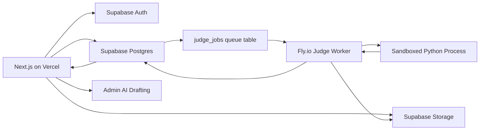

# Architecture

CodeArena splits product traffic from untrusted code execution.

## Boundaries

- Vercel handles UI, auth-aware routes, submission creation, and admin screens.
- Supabase stores durable state and broadcasts coarse submission updates.
- Fly.io runs judge workers because judging needs process control, timeouts, filesystem isolation, and future Linux sandboxing.
- Problem packages are stored as immutable versioned artifacts.

## Submission Lifecycle

1. User submits Python code from a problem or contest page.
2. App creates a `submissions` row with status `queued`.
3. App creates a `judge_jobs` row.
4. A Fly worker claims the next available job.
5. Worker downloads the problem package and submission.
6. Worker executes the submission against tests and checker rules.
7. Worker writes `submission_test_results`.
8. Worker writes the final verdict to `submissions`.
9. UI updates via polling first, then Supabase Realtime.

## ICPC Ranking

Contest standings are derived from immutable submissions:

- Rank by solved count descending.
- Break ties by total penalty ascending.
- Break further ties by last accepted minute ascending.
- Wrong submissions before first AC add 20 penalty minutes.
- Submissions after first AC do not affect scoring.

